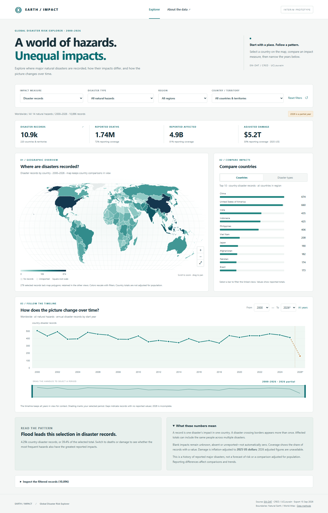

# Global Disaster Risk Explorer

An interactive D3.js dashboard for exploring the occurrence and reported impacts of natural disasters. Built for the data visualization class project by Tobias Garcia and Ha Nguyen.

## Run locally

From this folder:

```powershell
python -m http.server 8000 --bind 127.0.0.1
```

Open **http://127.0.0.1:8000**. Stop the server with Ctrl+C. A local HTTP server is needed to load the data; opening `index.html` directly will not work. No npm installation or build step is required, and all runtime libraries and data are bundled locally.

## Explore

- Compare country totals on the interactive world map; zoom, pan, or select a country.
- Switch between records, reported deaths, affected populations and adjusted damage.
- Filter by any of the 14 natural-hazard types, region or country/territory.
- Compare country or hazard rankings and select a bar to filter linked views.
- Drag the timeline brush handles or use year selectors to zoom the detail chart; switch between yearly and monthly resolution.
- Play annual map slices with a fixed color scale, without changing the selected range.
- Explore seasonal record averages, disaster-type composition, and a geographical treemap with country drill-down.
- Inspect reporting coverage, individual records, and download the filtered CSV.

The default scope is **2000–2026, all natural hazards**. **2026 is partial.** Adjusted damage uses **2025 USD**. Unknown impacts remain null; recorded totals are not estimates of future risk.



## Data and reproduction

The original EM-DAT export supplied by the project owner is preserved in `data/raw/`. It has 10,896 country-disaster records, 9,001 distinct event identifiers, 220 countries/territories, and 14 hazard types.

```powershell
python -m pip install -r requirements.txt
python scripts/prepare_data.py data/raw/public_emdat_custom_request_2026-09-15_8a971085-98e9-420a-9513-c44f4dc5eca4.xlsx --start-year 2000 --end-year 2026 --all-natural
```

Outputs include cleaned CSV/JSON, a source checksum and quality report, aggregates by country/type/year, impact distributions, largest-impact records and a generated analysis report. See [data methods](docs/data-methods.md) for the field dictionary and cleaning rules.

## Interim deliverables

- [Interim checklist, findings and presentation walkthrough](docs/interim-status.md)
- [Finalized research questions](docs/research-questions.md)
- [Initial analysis](docs/initial-analysis.md)
- [Interface rationale and coordination rules](docs/interface-design.md)
- [Desktop/mobile wireframe](docs/interface-wireframe.svg)
- [Mobile prototype screenshot](docs/prototype-mobile.png)
- [Original project proposal](proposal.md)
- [Project rubric](project-rubric.md)

The dashboard now includes six linked views: choropleth, ranking, detail/overview timeline, seasonal bars, streamgraph and hierarchical treemap. See [implementation and verification](docs/enhancement-verification.md) and [monthly data methods](docs/data-methods.md).

## Verify

```powershell
python -m unittest discover -s tests -p test_data.py
node --test tests/data.test.js
```

For browser integration checks, leave the local server running, install Playwright if needed (`python -m pip install -r tests/requirements.txt`), then run:

```powershell
python tests/browser_check.py
```

The browser check detects installed Chrome on macOS/Windows, or uses Playwright Chromium on Linux. Set `CHROME_PATH` to override it. It verifies real-data totals and linked interactions, exports, empty/missing data states, mobile layout and local-only asset loading.

## Sources

Disaster data: [EM-DAT, CRED / UCLouvain](https://public.emdat.be/), export dated 15 September 2026. Definitions: [EM-DAT documentation](https://doc.emdat.be/docs/). Geography: Natural Earth via [World Atlas 2.0.2](https://github.com/topojson/world-atlas). Local libraries and licenses: [vendor notes](vendor/README.md).
