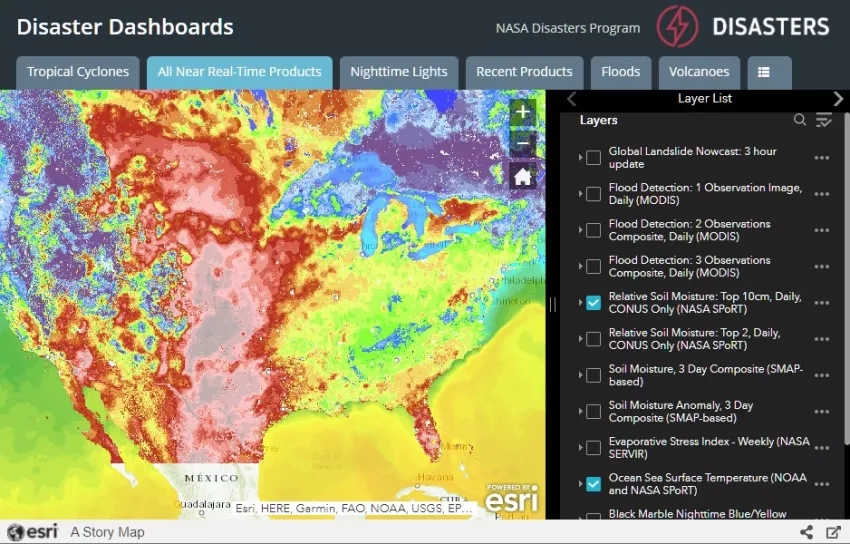
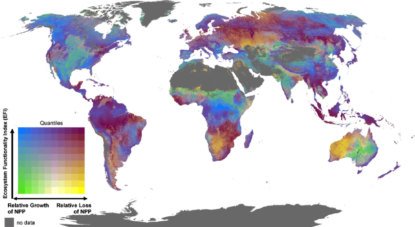
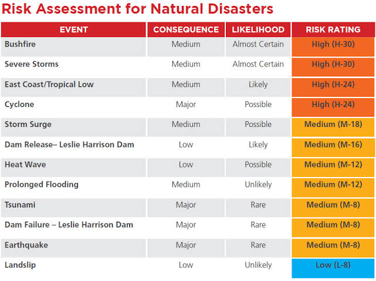
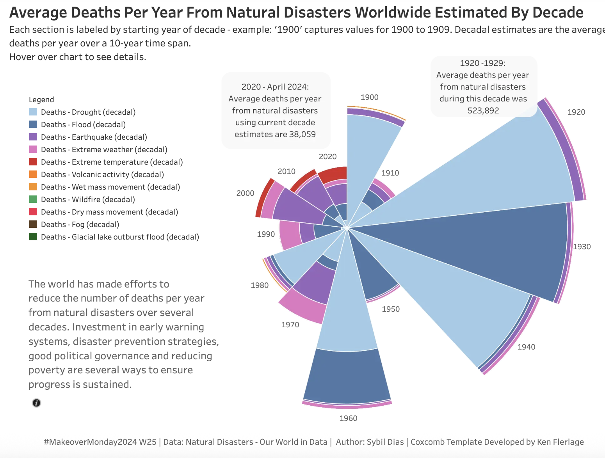
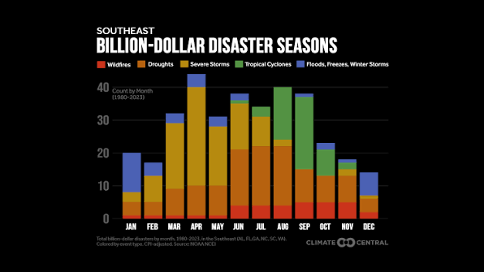

# Project Proposal: Global Disaster Risk Explorer

## 1. Topic, Goals, and Questions

### Topic

Our project, **Global Disaster Risk Explorer**, will be an interactive web visualization that explores the occurrence and impacts of natural disasters around the world. We want to investigate how different types of disasters affect different countries in terms of human casualties, affected populations, and economic damage.

Natural disasters provide a particularly interesting visualization challenge due to the several dimensions of data that are difficult to understand simultaneously. A single disaster can be described by its location, time, type, magnitude, number of deaths, number of people affected, and economic damage. These characteristics also vary between countries and disaster types. By combining these dimensions in an interactive visualization, users can explore patterns that would be otherwise difficult to identify from tables or static graphs.

Our project will use the [**EM-DAT Emergency Events Database**](https://doc.emdat.be/docs/), maintained by the Centre for Research on the Epidemiology of Disasters (CRED) at UCLouvain. EM-DAT currently contains more than 27,000 disaster records and covers a wide range of natural hazards, including floods, storms, earthquakes, droughts, wildfires, volcanic activity, landslides, and extreme temperatures.

### Visualization Goals

Our primary goal is to create an interactive **global disaster risk explorer** that allows users to:

- identify where and when different natural disasters occur,
- compare disaster types by frequency and severity,
- investigate differences in deaths, affected populations, and economic damage,
- identify countries or regions that experience unusually high disaster impacts, and
- explore how disaster patterns and impacts have changed over time.

Users should be able to select a disaster type, time period, country, or impact measure and see the other views update accordingly.

### Intended Audience

The primary audience is the general public and university students who are interested in natural hazards but may not have specialized knowledge of disaster science. The interface will therefore prioritize intuitive maps, clearly labeled charts, interactive filtering, and concise explanations of the measures being displayed.

### Research and Exploration Questions

Our visualization will focus on four main questions:

1. **Where and how frequently do different types of natural disasters occur around the world?**
2. **Which disaster types produce the greatest human and economic impacts?**
3. **Which countries or regions experience the greatest concentration of disaster impacts?**
4. **How do disaster frequency and disaster impact change across countries and over time?**

These questions will guide our data analysis and ensure that each visualization contributes to the same overall narrative.

---

## 2. Dataset

### Source and Acquisition

Our primary dataset will be the [**EM-DAT Public Table**](https://doc.emdat.be/docs/), available through the EM-DAT public data portal:  
[https://public.emdat.be/](https://public.emdat.be/)

This public data is a downloadable flat representation of EM-DAT in which each row represents a disaster impact in a particular country. We will download the dataset and use it as the project's primary data source rather than relying on multiple external datasets.

EM-DAT provides free access for non-commercial use, and the current data portal is updated regularly.

### Size and Attributes

EM-DAT currently contains more than **27,000** disaster records. The public table contains numerous variables describing each event, including:

- disaster type and subtype,
- country, region, and ISO country code,
- start and end dates,
- disaster magnitude and magnitude scale,
- total deaths,
- number injured,
- number affected,
- number homeless,
- total affected population, and
- total and inflation-adjusted economic damage.

These variables will provide sufficient dimensions for both geographic and quantitative visualization.

### Processing

Our preprocessing will be performed primarily with Python and pandas. We will remove irrelevant fields, standardize dates and categorical values, handle missing values, and restrict the dataset to natural hazards relevant to the project throuch data cleaning and transformation. We will derive additional variables such as disaster year and total human impact.

We will make sure to pay particular attention to any given missing values because an empty EM-DAT field may indicate either that an impact was absent or that the impact was unknown or unreported. We will therefore avoid automatically interpreting missing impact values as zero.

Additionally, we will ensure to document EM-DAT's limitations. The database primarily records major disasters meeting criteria such as at least 10 fatalities, at least 100 affected people, a declaration of emergency, or a request for international assistance. Consequently, our analysis will only represent recorded major disasters, not every natural hazard event.

---

## 3. Analysis and Visualization Methods

Our implementation will use HTML, CSS, JavaScript, and D3.js, with Python/pandas used for data cleaning, aggregation, and analysis.

We plan to develop at least five coordinated visualization idioms:

1. **Interactive world choropleth map**: compare countries by disaster frequency or impact.
2. **Proportional-symbol map**: display the magnitude of disaster impacts at geographic locations or countries.
3. **Interactive time-series chart**: identify changes in disaster frequency and impacts over time.
4. **Ranked bar chart**: compare countries or disaster types according to deaths, affected people, or economic damage.
5. **Scatterplot**: investigate relationships between disaster frequency, affected population, deaths, and economic damage.

Instead of treating these as independent charts, however, they will form a linked-view interface. Selecting a disaster type or country will update the other visualizations. Users will be able to filter by year, disaster type, region, and impact measure.

The principal user tasks will therefore include comparison, filtering, trend identification, geographic exploration, relationship discovery, and perhaps outlier detection.

---

## 4. Visualization Sketches or References

| Proposed visualization | Technique | Purpose |
|------------------------|-----------|---------|
| Global disaster map | Choropleth map | Shows which countries experience the highest concentration of selected disaster events or impacts. |
| Disaster impact map | Proportional symbols | Allows users to compare the geographic scale of individual or aggregated disaster impacts. |
| Historical timeline | Line chart | Reveals how disaster frequency and impacts change over time. |
| Country/disaster ranking | Horizontal bar chart | Supports direct comparison of the most affected countries or most impactful disaster types. |
| Impact relationship | Scatterplot | Helps users investigate relationships between human and economic consequences. |

These designs may be revised after initial data analysis reveals the actual distributions and limitations of the data.

---

## 5. Group Roles and Responsibilities

As a two-person group, both of us will participate in all major stages while taking primary responsibility for different areas.

**Tobias Garcia** will lead data acquisition, cleaning, initial analysis, geographic data preparation, and D3 implementation of the interactive map and time-series visualizations.

**Ha Nguyen** will lead visualization and interface design, interaction design, comparative and statistical visualizations, and front-end development.

We will both contribute to data analysis, testing, debugging, documentation, presentation preparation, and final integration. Additionally, each member will review and understand the complete implementation throughout the process rather than working on isolated components.

---

## 6. Interim Presentation Deliverables

By the interim presentation, we expect to have:

- downloaded and inspected the EM-DAT dataset,
- completed initial data cleaning and transformation,
- performed initial analysis of disaster types, countries, years, deaths, affected populations, and economic damage,
- finalized the primary research questions,
- produced initial sketches or mockups for the interface,
- implemented a preliminary D3.js world map, and
- implemented at least one additional interactive visualization, such as a time-series chart.

During the interim presentation, we will demonstrate a working prototype using a subset or initial version of the processed data and explain how our visualization design evolved from initial analysis.

---

## 7. Timeline and Milestones

| Week | Milestone | Tasks | Member(s) | Expected Output |
|------|-----------|-------|-----------------------|-----------------|
| **Week 2** | Project Definition | Finalize topic, research questions, visualization goals, and EM-DAT scope. Research existing reference visualizations. | Both | Final project concept and initial sketches |
| **Week 3** | Data Preparation | Download EM-DAT, inspect variables, clean missing values, standardize dates/categories, prepare geographic data. | Tobias Garcia | Cleaned and documented dataset |
| **Week 4** | Visualization Design | Perform initial analysis; test map, timeline, ranking, and scatterplot designs; finalize interaction plan. | Both | Refined designs and analytical findings |
| **Week 5** | Interim Prototype | Implement initial D3 map, timeline, filters, and basic interface. Prepare presentation demonstrating data preparation and prototype. | Tobias Garcia: map/data; Ha Nguyen: interface/charts | Working prototype and interim presentation |
| **Week 6** | Implementation & Refinement | Complete remaining visualizations, linked interactions, tooltips, filtering, responsive interface, and visual refinement. | Both | Near-complete interactive visualization |
| **Week 7** | Final Integration | Conduct testing, fix interaction and data issues, verify analytical results, complete documentation, and prepare final presentation. | Both | Final visualization, documentation, and presentation |

Overall, the project will progress from **data acquisition and exploration → visualization design → prototype development → interactive implementation → testing and final integration**, ensuring that the workload is distributed across the full project period.